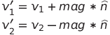
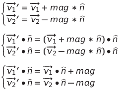

**What is this?** A really quick primer on how/why the physics equations work. Mostly to prove to myself that I understand it all. Though it could also be helpful if you're aiming to hack the repo and want to understand why things are the way they are.

**Prerequisites:**

* Basic Newtonian physics (i.e. linear and angular forces with a vague understanding of how calculus fits in).
* Basic matrix math (i.e. translations/rotations and how "spaces" are defined by square matrices).
* General physics engine design (this doc is JUST about the physics, I assume you know how it fits into the rest of the engine).

## General Things

This physics engine is currently based on physical impulses. So it focuses on handling things at a *velocity* level, rather than an *acceleration/force* level. I aimed for this as it seems to make things simpler (i.e. less integration) which also probably makes them a little easier to make stable.

## First: Linear Kinetic Motion

First the basics. As Newton first described, a force is defined as:

```
force = mass * acceleration
```

This is mildly important to an impulse-based physics engine as it establishes what mass really means for linear kinetic motion: it describes how hard it is to get something moving. Put another way, if a force is applied to an object, it accelerates at:

```
acceleration = force / mass
```

With that, it's possible to take an arbitrary number of forces, sum them, and get the resulting net acceleration. This is how force generators (like gravity) will work in the system. To turn that acceleration into useful quantities it will need to be integrated periodically like so:

```
linear_velocity += linear_acceleration * dt
linear_position += linear_velocity * dt
```

The above is known as "Semi-implicit Euler Integration", and it's generally what games use as its fast and reasonably effective. There are much more accurate ways to do this, but it's possible to get a "good-enough looking" simulation without them.

Though, for this physics engine, the the collision response is baked into the velocity and position. So it's more like:

```
projected_linear_velocity += linear_acceleration * dt
projected_linear_displacement = projected_linear_velocity * dt
(final_linear_position, final_linear_velocity) = account_for_collisions(
	projected_linear_displacement,
	projected_linear_velocity,
)
```

Next it's important to understand one way in which collisions can be characterized:

* In an **elastic** collision, all kinetic energy is conserved (remains constant). A world with nothing but elastic collisions would look a bit like a bouncy ball that never stops bouncing.
* In an **inelastic** collisions, some energy is lost. A completely inelastic collision would be like dropping a steel ball into some sand. The ball will just hit the sand and stop.

This is important because these two extremes must, in some way, modeled in the world's physics. In this engine, the elasticity of a collision is stored as a `restitution_coefficient`. When that value is `0.0` the collision is completely inelastic. When it's `1.0` the collision is completely elastic. The `restitution_coefficient` is stored as a property of the colliders. When two colliders hit, their `restitution_coefficients` are multiplied together to get the final `restitution_coefficient` for the collision.

With that out of the way, here's the equation for linear kinetic energy:

```
linear_kinetic_energy = 0.5 * mass * linear_speed^2
```

As described above; the total of it in a system can be made to be completely conserved, depending on what the `restitution_coefficients` are set to.

Unlike energy, momentum is _always_ conserved. Though it's not used much in this document, here's the equation for it:

```
linear_momentum = mass * linear_velocity
```

### Derivation of Collision Response

With all that written out. It's now possible to derive how what `account_for_collisions()` should do when it finds two objects colliding. To keep things simple, we'll start with the case of an elastic collision between two masses. The equation for conserving mass would be:

```
0.5 * mass_1 * initial_speed_1 ^ 2 + 0.5 * mass_2 * initial_speed_2 ^ 2 = 0.5 * mass_1 * final_speed_1 ^ 2 + 0.5 * mass_2 * final_speed_2 ^ 2
```

To keep things readable, I'm going to shorten the names to:

*  is `mass_1`
*  is `mass_2`
*  is `initial_speed_1`
*  is `initial_speed_2`
*  is `final_speed_1`
*  is `final_speed_2`

So the above becomes:


To make this solvable, we'll simplify the system to only change the velocity in the direction of the normal:



The above can then further be modified to focus just on the velocity change in the direction of the normal:



Now since the velocity will only change along the collision `normal`, and equation equating total energy before and after the collision can drop any energy coming from speed orthogonal to the `normal` as it will never change. So the energy equation becomes:


Each squared term on the right can be expanded, and then cancel with a term on the right:


So the whole equation becomes:


Now, since the collision must change the object trajectory to prevent them from sliding into one another, the `impulse_magnitude`/ cannot be zero. So it's safe to divide it out.


```
0.5 * m_1 * (iv_1 dot normal) ^ 2 + 0.5 * m_2 * (iv_2 dot normal) ^ 2 = 0.5 * m_1 * (fv_1 dot normal) ^ 2 + 0.5 * m_2 * (fv_2 dot normal) ^ 2
---
m_1 * (iv_1 dot normal) ^ 2 + m_2 * (iv_2 dot normal) ^ 2 = m_1 * (fv_1 dot normal) ^ 2 + m_2 * (fv_2 dot normal) ^ 2
---
m_1 * (iv_1 dot normal) ^ 2 + m_2 * (iv_2 dot normal) ^ 2 = m_1 * (iv_1 dot normal + impulse_magnitude) ^ 2 + m_2 * (iv_2 dot normal - impulse_magnitude) ^ 2
---
m_1 * (iv_1 dot normal) ^ 2 + m_2 * (iv_2 dot normal) ^ 2 = m_1 * ((iv_1 dot normal) ^ 2 + 2 * impulse_magnitude * (iv_1 dot normal) + impulse_magnitude ^ 2) + m_2 * ((iv_2 dot normal) ^ 2 - 2 * impulse_magnitude * (iv_2 dot normal) + impulse_magnitude ^ 2)
---
0 = m_1 * (2 * impulse_magnitude * (iv_1 dot normal) + impulse_magnitude ^ 2) + m_2 * (-2 * impulse_magnitude * (iv_2 dot normal) + impulse_magnitude ^ 2)
---
0 = m_1 * (2 * impulse_magnitude * (iv_1 dot normal) + impulse_magnitude ^ 2) + m_2 * (-2 * impulse_magnitude * (iv_2 dot normal) + impulse_magnitude ^ 2)
---
0 = (m_1 * (2 * (iv_1 dot normal) + impulse_magnitude) + m_2 * (-2 * (iv_2 dot normal) + impulse_magnitude)) * impulse_magnitude
```

Since the collision must change something to prevent objects from sliding into each other, `impulse_magnitude` cannot be zero. So it can be divided out.

```
0 = (m_1 * (2 * (iv_1 dot normal) + impulse_magnitude) + m_2 * (-2 * (iv_2 dot normal) + impulse_magnitude)) * impulse_magnitude
---
0 = m_1 * (2 * (iv_1 dot normal) + impulse_magnitude) + m_2 * (-2 * (iv_2 dot normal) + impulse_magnitude)
---
0 = m_1 * 2 * (iv_1 dot normal) + m_1 * impulse_magnitude - m_2 * 2 * (iv_2 dot normal) + m_2 * impulse_magnitude
---
0 = m_1 * 2 * (iv_1 dot normal) - m_2 * 2 * (iv_2 dot normal) + m_1 * impulse_magnitude + m_2 * impulse_magnitude
---
-(m_1 * 2 * (iv_1 dot normal) - m_2 * 2 * (iv_2 dot normal)) = m_1 * impulse_magnitude + m_2 * impulse_magnitude
---
-(m_1 * 2 * (iv_1 dot normal) - m_2 * 2 * (iv_2 dot normal)) = (m_1 + m_2) * impulse_magnitude
---
impulse_magnitude = -2 * (m_1 * (iv_1 dot normal) - m_2 * (iv_2 dot normal)) / (m_1 + m_2)
```

Now for the physics engine it's often nice to be able to set a mass as "infinite" and have that effectively mean that any collision with it will result in it never moving. If that were to happen with the above equation, it'd get an indeterminate `infinity / infinity`. To work against that, everything on the right can be multiplied by `(m_1 ^ -1 * m_2 ^ -1) / (m_1 ^ -1 * m_2 ^ -1)` like so:

```
-2 * (m_1 * (iv_1 dot normal) - m_2 * (iv_2 dot normal)) / (m_1 + m_2) * (m_1 ^ -1 * m_2 ^ -1) / (m_1 ^ -1 * m_2 ^ -1)
---
-2 * ((m_1 * (iv_1 dot normal) - m_2 * (iv_2 dot normal)) *  (m_1 ^ -1 * m_2 ^ -1)) / ((m_1 + m_2) * (m_1 ^ -1 * m_2 ^ -1))
---
-2 * (m_2 ^ -1 * (iv_1 dot normal) - m_1 ^ -1 * (iv_2 dot normal)) / (m_2 ^ -1 + m_1 ^ -1)
```

**TODO: Fix the above!**

## Angular Kinetic Motion

Next up, it's time to talk about rotation. This is really the main reason I'm writing any of this up; I found it difficult to understand so I want to make sure everything still makes sense once it's on paper.

That said, angular motion is very similar to linear motion in how it's calculated. That is to say, any body will be sent through 2-levels of Semi-implicit Euler Integration:

```
angular_velocity += angular_acceleration * dt
angular_displacement = angular_velocity * dt
angular_position = account_for_collisions(angular_displacement)
```

Note that `angular_position` is just rotation. It's stored as a "Quaternion" internally, though for the sake of this explanation it's easier to think of it as a simple 3D vector (i.e. a series of three scalar values: x, y, and z). This is essentially how it's treated by the physics engine when doing computation. One could probably switch it to use a vector without anything breaking (probably...), though I'm not sure I'll bother to verify that.

Now, since it's really non-obvious, vectors encode arbitrary rotations through multiplication:

```
rotation_vector = unit_length_axis_of_rotation_vector * rotation_amount_in_radians
```

So the vector's direction is the axis of rotation, and it's length is how much to rotate (according to the right-hand-rule). This notation is extremely versatile as, perhaps surprisingly, simple vector addition between two rotation vectors exactly maps to just applying both rotations in series. Or at least it does so well enough that pretty much all math here does that to model things.


Now with that, it's next important to understand how linear energy is moved into rotation. That is to say, it's time to start using cross product. Now if a force is applied to an object, then it can rotate the object by producing a torque, which is calculated by:

```
torque = force_vector X offset
```

Here the `X` means **cross product**, and the `offset` is the vector from the object's **center of mass** to the point where the force is being applied. (More on why the center of mass is important soon.) The torque is basically the rotational equivalent to a linear force.

Notably the cross product can also be used to convert the angular velocity of an object into the linear velocity at a specific point:

```
angular_velocity = linear_velocity X offset
angular_velocity X offset = linear_velocity
```

This will become useful later when discussing collisions.

Now back to foundational angular motion concepts. The **center of mass** is important as it's basically the "true center" of the object when it comes to rotations. That is to say, applying a force directly at the center of mass won't cause the object to rotate, because all mass is "balanced" across any line that goes through that point. This is encoded in the above equation's cross product since the cross product between any two parallel vectors is always zero.

With that in mind, the next bit of physics that needs introducing is the concept of **moment of inertia**. In a nut-shell, it describes how hard it is to rotate an object about some specific axis. Note that the *specific axis* part is key; whenever a moment of inertia is described in physics contexts it's always about some implicit axis that's been pre-determined. And in that case it always is a scalar value.

However, as described above, rotations in the physics engine are going to be about any arbitrary axis, so we need a way to describe all possible moments of inertia. This is done through the **moment of inertia tensor**, which is a 3-by-3 matrix that converts a (unit) vector into its moment of inertia along each cardinal axis. Described visually:

```
         [# # #]              [n.x]      [ scalar "moment of inertia around n" for the x-axis ]
         [# # #]         *    [x.y]    = [ scalar "moment of inertia around n" for the y-axis ]
         [# # #]              [x.z]      [ scalar "moment of inertia around n" for the z-axis ]
Moment of inertia tensor * some normal = vector of moments of inertia
```

This might seem horribly confusing (and it will become so later on), but for now it actually makes everything really simple, because for any of the simple (i.e. one-dimensional) angular motion equations that require the *scalar* moment of inertia, one can usually just drop in the correct moment of inertia tensor and switch everything else to vectors and everything will just work.

(Though the *correct* moment of inertia tensor is complicated to calculate. And you have to be vary careful to *always* use the center of mass to represent the object. More on that later.)

So, to bring all this back to the physics engine. The moment of inertia tensor works like this:

```
moment_of_inertia_tensor * angular_acceleration = torque
```

Which can be rearranged to get the needed value:

```
angular_acceleration = inverse_moment_of_inertia_tensor * torque
angular_acceleration = inverse_moment_of_inertia_tensor * (force_vector X offset)
```

So now there's a way to go from a forces applied to the surface to angular acceleration.

To complete the analog with the _Linear Kinetic Motion_ section, angular movement it's possible to calculate the energy stored in rotation with:

```
energy = 0.5 * moment_of_inertia_about_angular_velocity * angular_velocity_magnitude ^ 2
energy = 0.5 * (moment_of_inertia_tensor * angular_velocity) dot angular_velocity
```

Here `dot` means the dot product. As with before, the total energy may or may not be conserved depending on the `restitution_coefficient`. Oppositely, the angular momentum is always conserved in a collision:

```
angular_momentum = moment_of_inertia * angular_velocity
```

So now comes the hard part, pulling this all together into some sort of collision response.

### Aside: Calculating Center of Mass and the Moment Of Inertia Tensor

**TODO!**

## Then Friction?

TODO!