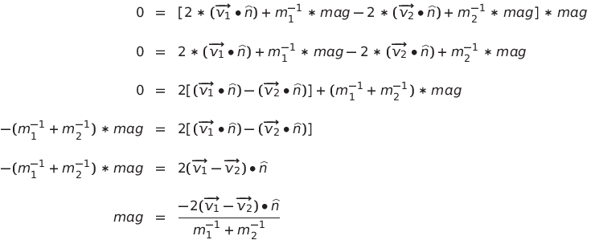
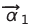
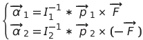
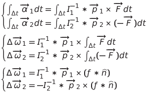
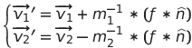
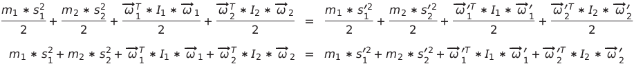
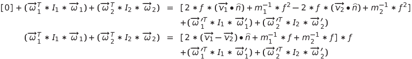
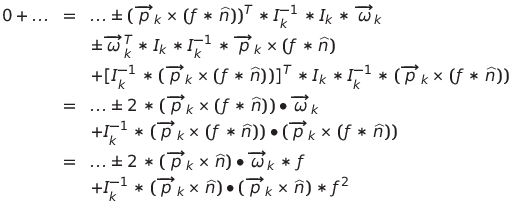

**What is this?** A really quick primer on how/why the physics equations work. Mostly to prove to myself that I understand it all. Though it could also be helpful if you're aiming to hack the repo and want to understand why things are the way they are.

**Prerequisites:**

* Basic Newtonian physics (i.e. linear and angular forces with a vague understanding of how calculus fits in).
* Basic matrix math (i.e. translations/rotations and how "spaces" are defined by square matrices).
* General physics engine design (this doc is JUST about the physics, I assume you know how it fits into the rest of the engine).

## 1. General Things

This physics engine is currently based on physical impulses. So it focuses on handling things at a *velocity* level, rather than an *acceleration/force* level. I aimed for this as it seems to make things simpler (i.e. less integration) which also probably makes them a little easier to make stable.

## 2. Linear Kinetic Motion

First the basics. As Newton first described, a force is defined as:

```
force = mass * acceleration
```

This is mildly important to an impulse-based physics engine as it establishes what mass really means for linear kinetic motion: it describes how hard it is to get something moving. Put another way, if a force is applied to an object, it accelerates at:

```
acceleration = force / mass
```

With that, it's possible to take an arbitrary number of forces, sum them, and get the resulting net acceleration. This is how force generators (like gravity) will work in the system. To turn that acceleration into useful quantities it will need to be integrated periodically like so:

```
linear_velocity += linear_acceleration * dt
linear_position += linear_velocity * dt
```

The above is known as "Semi-Implicit Euler Integration", and it's generally what games use as its fast and reasonably effective. There are much more accurate ways to do this, but it's possible to get a "good-enough looking" simulation without them.

Though, for this physics engine, the the collision response is baked into the velocity and position. So it's more like:

```
projected_linear_velocity += linear_acceleration * dt
projected_linear_displacement = projected_linear_velocity * dt
(final_linear_position, final_linear_velocity) = account_for_collisions(
	projected_linear_displacement,
	projected_linear_velocity,
)
```

Next it's important to understand one way in which collisions can be characterized:

* In an **elastic** collision, all kinetic energy is conserved (remains constant). A world with nothing but elastic collisions would look a bit like a bouncy ball that never stops bouncing.
* In an **inelastic** collisions, some energy is lost. A completely inelastic collision would be like dropping a steel ball into some sand. The ball will just hit the sand and stop.

This is important because these two extremes must, in some way, modeled in the world's physics. In this engine, the elasticity of a collision is stored as a `restitution_coefficient`. When that value is `0.0` the collision is completely inelastic. When it's `1.0` the collision is completely elastic. The `restitution_coefficient` is stored as a property of the colliders. When two colliders hit, their `restitution_coefficients` are multiplied together to get the final `restitution_coefficient` for the collision.

With that out of the way, here's the equation for linear kinetic energy:

```
linear_kinetic_energy = 0.5 * mass * linear_speed^2
```

As described above; the total of it in a system can be made to be completely conserved, depending on what the `restitution_coefficients` are set to.

Unlike energy, momentum is _always_ conserved. Here's the equation for it:

```
linear_momentum = mass * linear_velocity
```

### 2.1. Derivation of Linear Collision Response

With all that written out. It's now possible to derive how what `account_for_collisions()` should do when it finds two objects colliding. To keep things simple, we'll start with the case of an elastic collision between two masses. The equation for conserving momentum and energy:

```
mass_1 * initial_velocity_1 + mass_2 * initial_velocity_2 =  mass_1 * final_velocity_1 + mass_2 * final_velocity_2
0.5 * mass_1 * initial_speed_1 ^ 2 + 0.5 * mass_2 * initial_speed_2 ^ 2 = 0.5 * mass_1 * final_speed_1 ^ 2 + 0.5 * mass_2 * final_speed_2 ^ 2
```

Now since these equations are going to get really long, I'm going to rename the variables into something that's easy to display in LaTeX:

*  is `mass_1`
*  is `mass_2`
*  is `initial_velocity_1`
*  is `initial_velocity_2`
*  is `final_velocity_1`
*  is `final_velocity_2`
*  is `initial_speed_1` which is the length of `initial_velocity_1`
*  is `initial_speed_2` which is the length of `initial_velocity_2`
*  is `final_speed_1` which is the length of `final_velocity_1`
*  is `final_speed_2` which is the length of `final_velocity_2`

So the above become:


To start, we'll focus on the momentum equation. In order to make the entire system solvable, it's important to realize the two objects will react by moving in opposite directions along the same normal (i.e. Newton's Third Law). However the magnitude of those changes can be different (i.e. imagine a tennis ball hitting an asteroid; the asteroid won't move much). So the relationship between the initial and final velocities should be:


To solve for the relationship between these two magnitudes, we'll plug them into the momentum equation:


Which is most elegantly solved by simply scaling each by the corresponding inverse mass term. This updates the velocity equations to:


Now, for reasons that will become apparent in a moment, here's what happens when all those values are focused along just the normal:


And that's really all the inertia equation is good for. So lets now focus on the conservation of energy equation:


Now since the velocity will only change along the collision `normal`, and equation equating total energy before and after the collision can drop any energy coming from speed orthogonal to the `normal` as it will never change. So the energy equation becomes:


Each squared term on the right can be expanded, and then cancel with a term on the left:


So the whole equation becomes:


Now, since the collision must change the object trajectory to prevent them from sliding into one another, the `impulse_magnitude`/ cannot be zero. So it's safe to divide it out.



With that equation, all elastic collisions are ready to go. But it's not yet clear how to integrate the `restitution_coefficient` into it. So let's see how it could be made to turn the velocity between the two (along the normal) zero:


So it looks like the `-2` term just has to become `-1` when `restitution_coefficient` is `0`. That leaves the final equations of motion as:


## 3. Angular Kinetic Motion

Next up, it's time to talk about rotation. This is really the main reason I'm writing any of this up; I found it difficult to understand so I want to make sure everything still makes sense once it's on paper.

That said, angular motion is very similar to linear motion in how it's calculated. Which is to say, any body will be sent through 2-levels of Semi-Implicit Euler Integration:

```
projected_angular_velocity += angular_acceleration * dt
projected_angular_displacement = angular_velocity * dt
(final_angular_position, final_angular_velocity) = account_for_collisions(
	projected_angular_displacement,
	projected_angular_velocity,
)
```

Note that `angular_position` is just rotation. It's stored as a "Quaternion" internally, though for the sake of this explanation it's easier to think of it as a simple 3D vector (i.e. a series of three scalar values: x, y, and z). This is essentially how it's treated by the physics engine when doing computation. One could probably switch it to use a vector without anything breaking (probably... quaternions tend to re-normalize automatically unlike vectors), though I'm not sure I'll bother to verify that.

Now, since it's really non-obvious, vectors encode arbitrary rotations through multiplication:

```
rotation_vector = unit_length_axis_of_rotation_vector * rotation_amount_in_radians
```

So the vector's direction is the axis of rotation, and it's length is how much to rotate (according to the right-hand-rule). This notation is extremely versatile as, perhaps surprisingly, simple vector addition between two rotation vectors exactly maps to just applying both rotations in series. Or at least it does so well enough that pretty much all math here does that to model things.


Now with that, it's next important to understand how linear energy is moved into rotation. That is to say, it's time to start using cross product. Now if a force is applied to an object, then it can rotate the object by producing a torque, which is calculated by:

```
torque = offset X force_vector
```

Here the `X` means **cross product**, and the `offset` is the vector from the object's **center of mass** to the point where the force is being applied. (More on why the center of mass is important soon.) The torque is basically the rotational equivalent to a linear force.

Notably the cross product can also be used to convert the angular velocity of an object into the linear velocity at a specific point:

```
angular_velocity X (p - center_of_mass) = linear_velocity_at_p
```

This will become useful later when discussing collisions.

Now back to foundational angular motion concepts. The **center of mass** is important as it's basically the "true center" of the object when it comes to rotations. That is to say, applying a force directly at the center of mass won't cause the object to rotate, because all mass is "balanced" across any line that goes through that point. This is encoded in the above equation as the cross product between any two parallel vectors is always zero.

With that in mind, the next bit of physics that needs introducing is the concept of **moment of inertia**. In a nut-shell, it describes how hard it is to rotate an object about some specific axis. Note that the *specific axis* part is key; whenever a moment of inertia is described in physics contexts it's always about some implicit axis that's been pre-determined. As a result it is a *scalar value*.

However, as described above, rotations in the physics engine are going to be about any arbitrary axis, so we need a way to describe all possible moments of inertia. This is done through the **moment of inertia tensor**, which is a 3-by-3 matrix that converts a (unit) vector into its moment of inertia along each cardinal axis. Described visually:

```
         [# # #]              [n.x]      [ scalar "moment of inertia around n" for the x-axis ]
         [# # #]         *    [n.y]    = [ scalar "moment of inertia around n" for the y-axis ]
         [# # #]              [n.z]      [ scalar "moment of inertia around n" for the z-axis ]
Moment of inertia tensor * some normal =             vector of moments of inertia
```

This might seem horribly confusing (and it will become so later on), but for now it actually makes everything really simple, because for any of the simple (i.e. one-dimensional) angular motion equations that require the *scalar* moment of inertia, one can usually just drop in the correct moment of inertia tensor and switch everything else to vectors and everything will just work.

(Though the *correct* moment of inertia tensor is complicated to calculate. And you have to be vary careful to *_always_* use the center of mass to represent the object. More on that later.)

One other thing to know about the above moment of inertia tensor: due to how it's constructed (angular integration of `mass * distance`) it's **symmetric and contains only real values**.

So, to bring all this back to the physics engine. The moment of inertia tensor works like this:

```
moment_of_inertia_tensor * angular_acceleration = torque
```

Which can be rearranged to get the needed value:

```
angular_acceleration = inverse_moment_of_inertia_tensor * torque
angular_acceleration = inverse_moment_of_inertia_tensor * (offset X force_vector)
```

So now there's a way to go from a forces applied to the surface to angular acceleration.

To complete the analog with the _Linear Kinetic Motion_ section, angular movement it's possible to calculate the energy stored in rotation with:

```
energy = 0.5 * transposed_angular_velocity * inverse_moment_of_inertia_tensor * angular_velocity
```

As with before, the total energy may or may not be conserved depending on the `restitution_coefficient`.

Note that the transpose in the above is basically interchangeable with a dot product:

```
energy = 0.5 * angular_velocity dot (inverse_moment_of_inertia_tensor * angular_velocity)
```

Before diving into the derivation of the collision response, it's worth setting up one last thing: figuring out the _total_ velocity at a point. Since an object could conceivably have it's center of mass completely immobile but be spinning, obviously the angular velocity must contribute something to the value. Luckily this is just as easy as adding the linear and angular velocity equations above together:

```
total_velocity_at_p = linear_velocity_of_center_of_mass + angular_velocity X offset
total_velocity_at_p = linear_velocity_of_center_of_mass + angular_velocity X (p - center_of_mass)
```

### 3.1. Useful Vector Operator Properties

Before diving into further, here are a few useful (less commonly known) properties of vectors that will become useful later:

```
a dot (b X c) = c dot (a X b)
a dot (b X c) = b dot (c X a)
```

So for the above (a "triple product"), can easily swap around the operands.

### 3.2. Derivation of Angular Collision Response

First things first, to keep things readable, here are how all of the above verbose names map to single-letter counterparts:

*  is the `moment_of_inertia_tensor` for body 1.
*  is the `moment_of_inertia_tensor` for body 2.
*  is the `angular_velocity` for body 1 before the collision response.
*  is the `angular_velocity` for body 2 before the collision response.
*  is the `angular_velocity` for body 1 after the collision response.
*  is the `angular_velocity` for body 2 after the collision response.
*  is the vector from the center of mass for body 1 to the point of collision.
*  is the vector from the center of mass for body 2 to the point of collision.
*  is the force applied on body 1.
*  is the angular acceleration on body 1.
*  is the angular acceleration on body 2.

First thing's first, the force that affects the angular velocity applied will be along the normal, but in opposite directions for the two bodies. So the angular accelerations would be:



Now to get how the acceleration will affect the angular velocity, the equations need to be integrated. So assuming the force is applied over a short period of time (so the offset to the collision doesn't move and the moment of inertia tensors don't need to be reoriented), the overall change in velocity becomes:



Where the lower-case `f` is an unknown magnitude. Adding the before and after angular velocities gets:


Now one thing to know about `f` is that it's (basically) a stand in for the impulse applied at the point of collision. That means it takes the same place as `mag` took for the linear velocity changes:



With that it's now possible to solve for `f` when the collision is elastic by plugging the above into the total system energy equation:



Now the above equation is a bit hefty, even with single-letter variables, so it's best to attack it in pieces. First off, the same procedure used in the linear section can be applied to cut down the linear kinetic energy terms:



Then the angular kinetic energy can receive a similar treatment:





At this point everything on the left of the equation has been canceled, so the full equation looks like the below. Similar to the linear section, since there's an `f` in every term, (and `f` cannot be zero) one `f` can be removed.


From there, the same general logic regarding the `restitution_coefficient` (from the end of the _Derivation of Linear Collision Response_ section) can be applied to convert the `-2` into `-(1 + restitution_coefficient)`. This makes the final equations:


### 3.3. Aside: Calculating Center of Mass and the Moment Of Inertia Tensor

**TODO!**

Pitfalls:

* The tensors are ORIENTED. So in order to use them, must translate and rotate them into world space first! The easiest way I found to do this was to setup something that only handles storing the orientation info.
* Can only use the "parallel axis" equations ONCE when shifting away. To use them, the original tensor MUST be centered about the center-of-mass.
* There's a weird feed-back between storing the object's position as the center of mass and recalculating the center of mass?

## 4. Then Friction?

TODO!
